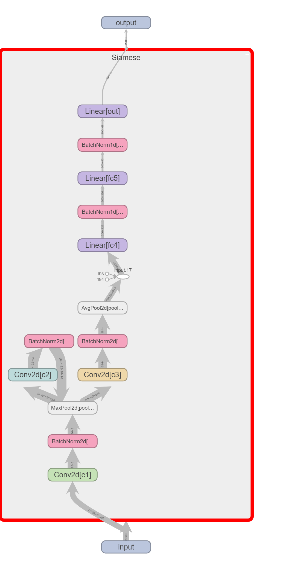
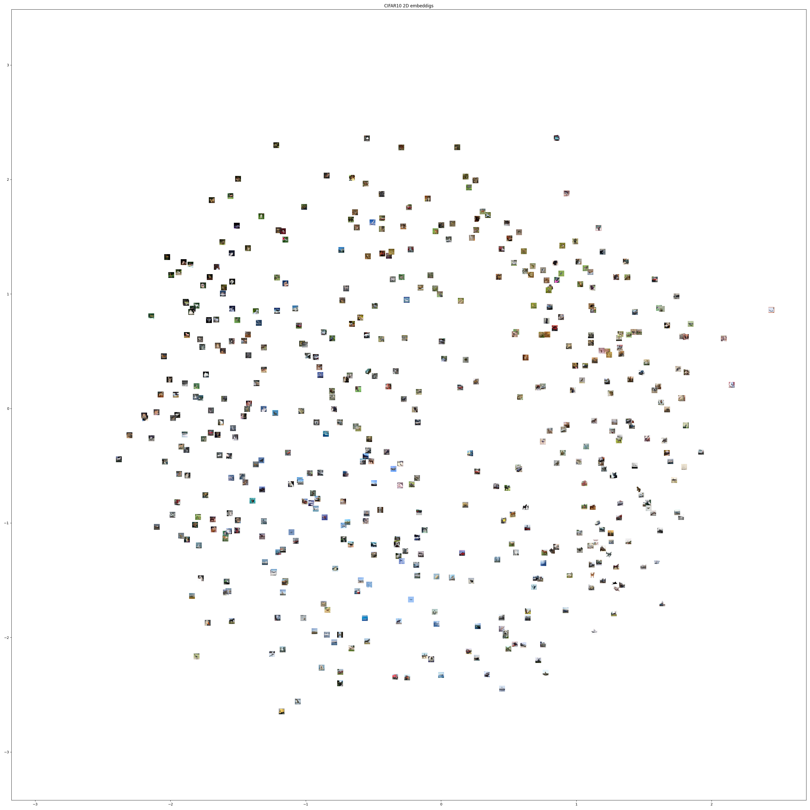
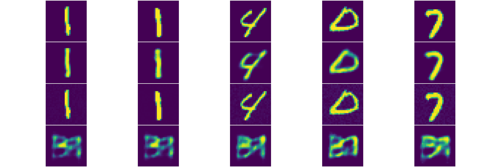
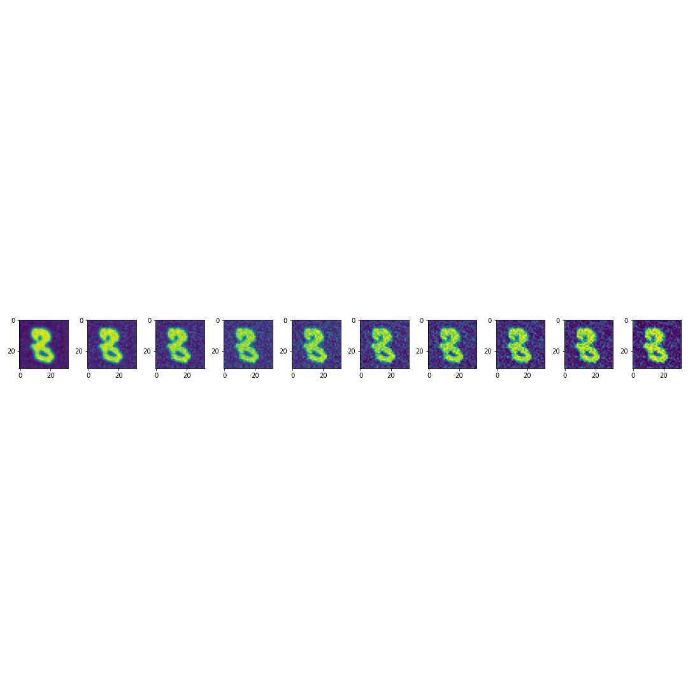
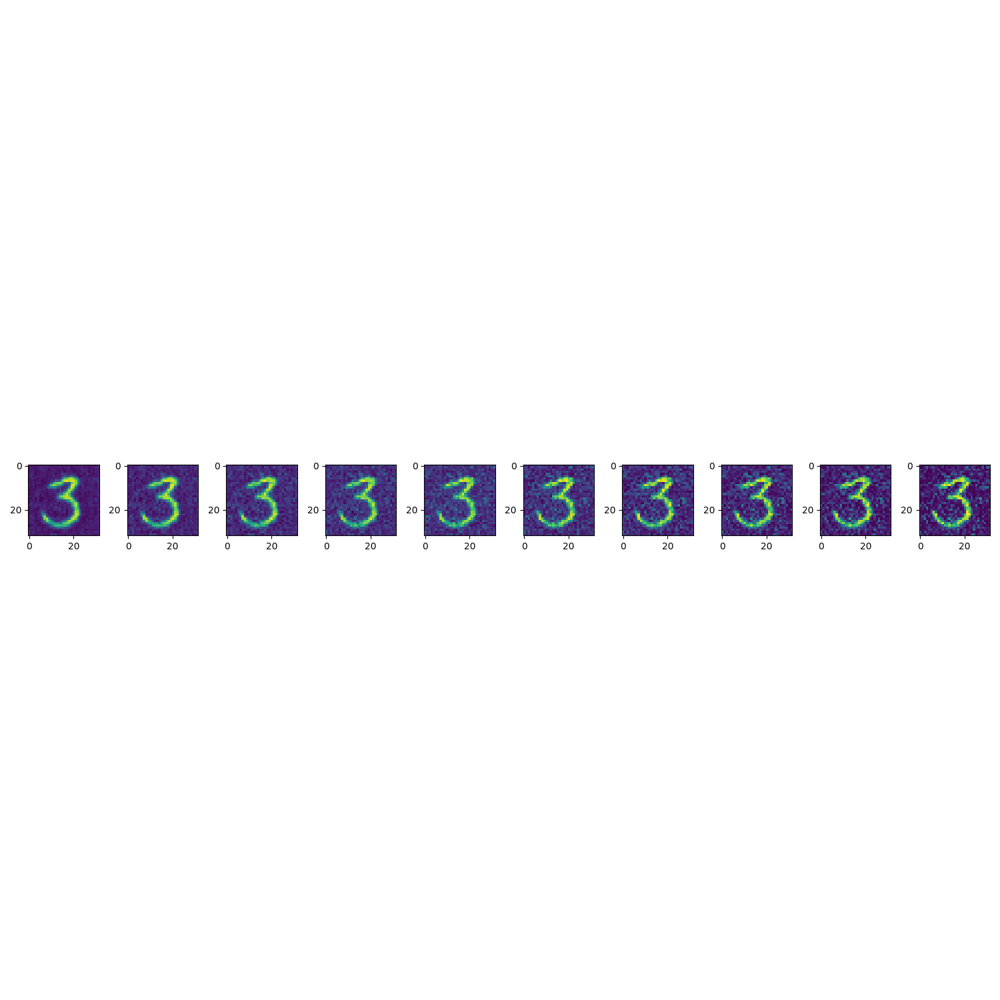
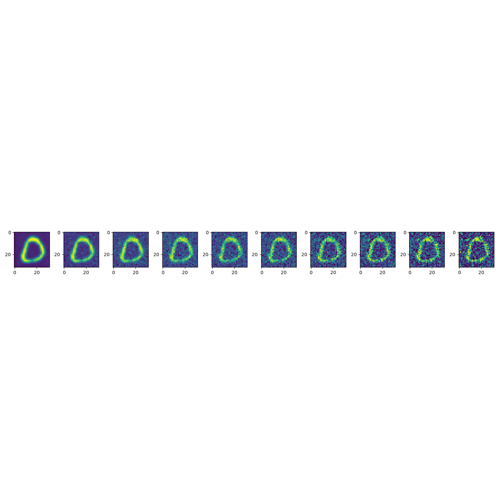

# Report For Basic Task
## [B2]image similarity
### Introduction and my personal ideal towards this task
    
        This is about calculating the similarty between two picture. To solve this problem a normal people might first try to recoginze the featrues in both picture then consider the appearance of these two featrues. If these two feature belongs to the same category, even though these two picture have a similar appearance, people will more likely to think that these two pictures have a high similarty. On the contrary, if each of the two pictures belongs to different category, as long as their appearance are not so similar that people cannot distinguish them, people will attend to consider these two pictures have a low similarty, even these two pictures are pixel alike. So if I want to make a neuro network which can solve this problem like a human, I need to build a neuro network which not only compare the pixel similarty but also need to consider about the category similarty.
    
        Because I am a rooky to the machine learning and neuro network, I first search the internet for a proper structure to solve the problem. Then I found the Siamese neural network which is designed to compare the similarty between two similar object which is very suitable to solve this task.
    
### A brief introbuction of Siamese neural network
    
        A Siamese neural network (sometimes called a twin neural network) is an artificial neural network that uses the same weights while working in tandem on two or more different input vectors to compute comparable output vectors. A simple interpretation to this network is that it use the same classification subnet for every input objects to compute the feature vector for comparing, which is very similar to a traditional classification model. It means that the structure of this network is almost the same with the classification model except it doesn't apply a softmax layer to translate the information vector into a list which contine the probability of which category the input belongs to. Instead, this network use a loss function directly calulate the similarty of the input objects through these feature vectors in this task I used the contrastive loss. 
>#### What is the contrastive loss
    
>        Contrastive loss is a loss function which compare the distance between two given vectors based on a label which tell the function whether the two vectors are belongs to the same category. The formular looks like this
> $$
> L(A,B)=y||F(A)-F(B)||^2+(1-y)\max(0, m^2-||F(A)-F(B)||^2)
> $$
        A, B represent the two input object in this case are two pictures, F() represents the Siamese network which translate the inputs into feature vectors, y represents whether the two input objects are belongs to same category (1 represent same category, 0 represent different catogory), $$||F(A)-F(B)||^2$$ represents the distance between the two feature vectors, and m is a hyperparameter which represents the max difference we accept while two inputs belong to different category. 
        A loss function is a function that we want its output decreases during the training. 
        First, let's consider the situation that the two inputs belong to the same category, in this case the formular equals to $$L(A,B)=||F(A)-F(B)||^2$$ which is the distance between the two feature vectors. The more accurate the network is, the smaller distance between the two feature vectors, this is exactly what we want for a loss function. 
        Then, let's consider about the situation that two inputs belong to different category, in this case, the distance between the two feature vectors should be very large, and the more accurate the network is, the more distance between the two feature vectors, which is comletely opposite to the taget of the loss function, so we need to reverse the calculation, so turn the $$||F(A)-F(B)||$$ into $$-||F(A)-F(B)||$$ is a very good way to reverse output, however this will bring us to another problem that is the vibration. While if the two inputs are already belong to different group, we can tell they are not similar as long as we can distinguish them properly, which means we don't need to enlarge the distance as large as we can, but we only need to enlarge the distance to a number which represent that we can distinguish these two picture is enough. Thus we can determine a upper bound m which represent that if the distance is bigger than this we can already regard this two picture belongs to different group, any distance larger than m is the same. So we can use the $$\max(0, m^2-||F(A)-F(B)||^2) $$ to do this operation, which not only reverse the distance but also make the output always bigger than zero.
    
        We can also use a Triplet loss or a more complex loss function to calculate the similarty of three or more inputs. However, making a dataset which suitable to calculate the similarty of three or more pictures is difficult and costly, so I choice the contrastive loss because it is easier to build a suitable dataset from CIFAR10.
    
### Building the dataset
    
        We can build the dataset by generate a group of picture pairs along with the number represent whether they are belong to same group. Every time I get a image from the dataset, I randomly decide whether the image pair belongs to the same group, then I randomly choose a picture from the same group or different group based on my perivous decision, and pack the three object.
### Network structure
        
        My Simaese network structure is look like the graph below. 

>
### Summary and the disadvantages
        This model performs well on the MNIST dataset, and is relatively easy to train. However, when I apply this model to the CIFAR dataset, it becomes hard to train and doesn't perform well. 
        
### Reference
1. Appalaraju S, Chaoji V. Image similarity using deep CNN and curriculum learning[J]. arXiv preprint arXiv:1709.08761, 2017.
2. [Siamese neural network](https://en.wikipedia.org/wiki/Siamese_neural_network)
3. Utkin L, Kovalev M, Kasimov E. An explanation method for Siamese neural networks[C]//Proceedings of International Scientific Conference on Telecommunications, Computing and Control. Springer, Singapore, 2021: 219-230.

### Code and result

## [B1]Reconstruct images from CIFAR or MNIST
### Introduction and my personal ideal towards this task
  In this task, I need to reconstruct a image from CIFAR or from MNIST. First I tried a VAE autoencoder. It has the ability to reconstruct the picture from the latent space, and is pretty easy to train on the MNIST dataset. However, it cannot reconstruct the image from an noisy image.
>
FIG_1: First line of pictures are the origin pictures, the second line of pictures are the images which reconstructed by VAE from the origin pictures,  the third line of the pictures are the noisy version of the origin pictures, the final line of the pictures are the images which reconstructed by VAE from the noisy pictures.

  Fig1 shows VAE network cannot handle the noisy input pictures. Because the VAE is tried to memorize the images in the dataset, and a noisy image does not belongs to the dataset. The VAE is try to use the encoder find the points in the latent space which represent the images in the dataset, then use the decoder to reconstruct, so when giving it a image doesn't belongs to the training dataset, it cannot find the proper point in the latent space, thus cannot use the decoder to reconstruct the image. May be a lossy encoding can solve the problem by ignoring the noise in the image, but my VAE didn't solve the problem. 
        
  After realized the VAE network cannot performs well on this task, I thought may be the diffusion model can solve this problem.
>#### A brief introduction to the Diffusion model
        Diffusion model is a model that not reconstruct the picture in just one time but several times instead, each time it removes a little bit of noise in the image, after running plenty of times, it can remove all the noise in the image. If the input is a pure noisy image, it can generate a new picture from the input which belongs to the dataset. 
        
   By consider the input noisy image as a image in the middle of the pure noisy and the input image, we can use the diffusion progress to remove the noise in the input image and reconstruct the image. Here are some of the result
>
FIG_2: the picture on the right is the input noisy image, and the picture on the left is the result diffusion model gives.

### Diffusion model (explaination from https://en.wikipedia.org/wiki/Diffusion_model)
  In machine learning, diffusion models, also known as diffusion probabilistic models or score-based generative models, are a class of latent variable generative models. A diffusion model consists of three major components: the forward process, the reverse process, and the sampling procedure. The goal of diffusion models is to learn a diffusion process that generates the probability distribution of a given dataset. They learn the latent structure of a dataset by modeling the way in which data points diffuse through their latent space.

  In the case of computer vision, diffusion models can be applied to a variety of tasks, including image denoising, inpainting, super-resolution, and image generation. This typically involves training a neural network to sequentially denoise images blurred with Gaussian noise. The model is trained to reverse the process of adding noise to an image. After training to convergence, it can be used for image generation by starting with an image composed of random noise for the network to iteratively denoise. Announced on 13 April 2022, OpenAI's text-to-image model DALL-E 2 is an example that uses diffusion models for both the model's prior (which produces an image embedding given a text caption) and the decoder that generates the final image. Diffusion models have recently found applications in natural language processing (NLP), particularly in areas like text generation and summarization.

  Diffusion models are typically formulated as markov chains and trained using variational inference. Examples of generic diffusion modeling frameworks used in computer vision are denoising diffusion probabilistic models, noise conditioned score networks, and stochastic differential equations.
        
### My personal understanding towards Diffusion model and the modification for the task

  In diffusion model we consider the noise image is generated by a noisyless picture through a markov chain, which gives us a chance to remove the noise through a opposite progress. The markov chain also gives us a chance to not to insert the noise many times in order to turn a image to a noise image, instead the markov chain provide a mathematical proof to generate the noise image in one time. Here I'm not going to give a mathiematical proof here, because I don't think I can explain better than this paper "Denoising Diffusion Probabilistic Models" So what we do in the training progress of diffusion model is that generating a $T$ level noisy image and then send it to the U-net to get a predicted noise distribute. Then use the loss function to judge the distance of the noise added and the predicted noise. When we need to reconstruct the image, we need to inverse the Markov chain, and after minus the predicted noise in each step, we need to add another standard normal distribution noise to the image in order to get the result. The paper didn't explain why they need add back this noise, so I guess that this noise is try to bring the wrongly predicted pixes back to noise. So in this way, we can generate a image from a pure noise image, but also with a little modify, we can denoise the picture, by just simply change the start point of the denoise progress.
  In this task I used a simple U-net and without using the VAE encoder and decoder, because I think the $1*32*32$ image is relatively small, I don't think using a complex U-net and the VAE encoder and decoder can largly improve the performance of the model, on the contrary, I think that make a complex model may cause overfitting problem and will largly increase the cost of time. I also want to use another simple cnn net to predict how much rounds of noise is insert in the picture, however the cnn network doesn't accuracy enough so I just simply mannuly input the predict of the noise rounds.
### My network structure
  My Simple U-net network structure is look like the graph below. 

>

### Summary and the disadvantages
  It works well on the MNISt dataset, it can clear the noise I add into the original image. The model can turn the noisy image into a sharp and clear image. However this model is still a generative model, so sometimes its result doesn't look like the original image. such as sometimes it will turn a noisy "8" image into "6". May be adding the text guide into the model will have a better performance.
  
### Code and result

           
